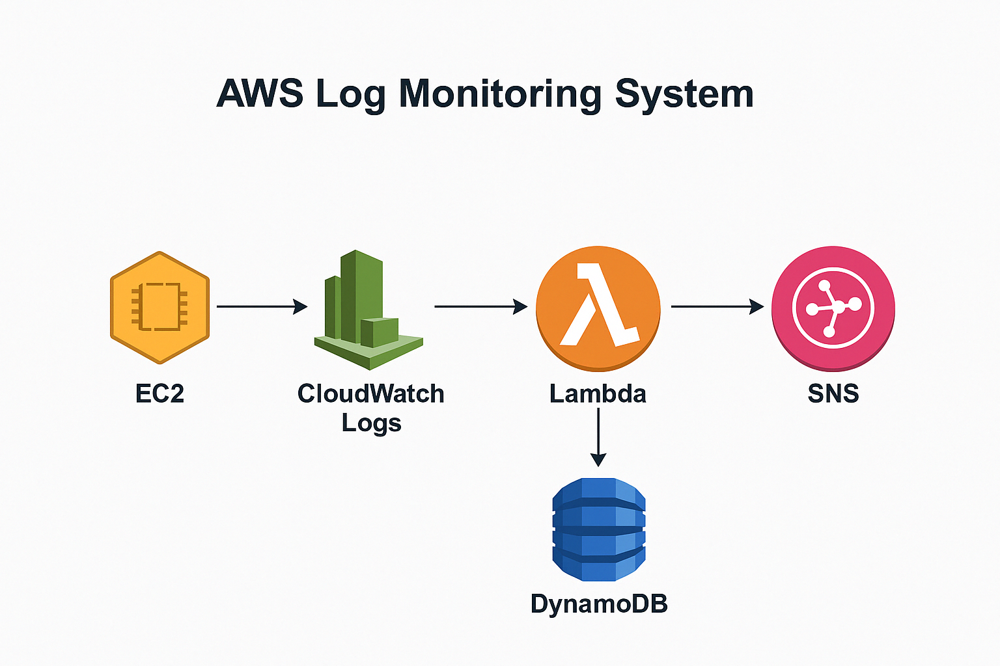

# 🚀 AWS Log Monitoring System

This project is a **real-time log monitoring solution** built with AWS services such as **CloudWatch Logs**, **Lambda**, **DynamoDB**, and **SNS**. It stores logs in a **DynamoDB** table and sends **alerts** for error-level logs via **SNS** email notifications.

---

## 📌 Features

- 📥 Logs streamed from **CloudWatch Logs**
- ⚙️ **AWS Lambda** function to process and parse logs
- 🗃️ Log storage in **DynamoDB**
- 📧 Sends **email alerts** via **SNS** for `ERROR` logs
- 🖥️ **Integration with EC2** log-generating applications

---

## 🛠️ Architecture

---

## 🧱 AWS Services Used

- **EC2** – Source of logs (e.g., your website or application)
- **CloudWatch Logs** – Centralized log management and storage
- **Lambda** – Log parsing and data processing
- **DynamoDB** – Stores structured log entries
- **SNS** – Sends email notifications for error-level logs

---

## Deployment Steps

### Step 1: EC2 Creation
1. **Launch an EC2 Instance**:
   - Choose an instance that suits your application (e.g., for your website).
2. **Attach IAM Role** to EC2:
   - Attach the `EC2CloudWatchLogsRole` IAM role with the following policies:
     - `CloudWatchLogsFullAccess`
     - **Inline policy** to allow logging permissions (e.g., `logs:CreateLogStream`, `logs:PutLogEvents`).
3. **SSH into EC2**:
   - Connect via SSH and configure the application to send logs to **CloudWatch Logs**.

---

### Step 2: Create CloudWatch Log Group and Log Stream
1. **Create a CloudWatch Log Group**: 
   - Use AWS CLI or the Console to create a **Log Group** (`MyAppLogs`).
2. **Create a Log Stream** within the Log Group:
   - Name it **`MyAppStream`** for your log events.

---

### Step 3: Create DynamoDB Table
1. **Create DynamoDB Table**:
   - Table Name: `LogTable`
   - Partition Key: `log_id` (Type: String)

---

### Step 4: Create SNS Topic and Subscription
1. **Create an SNS Topic** for alert notifications:
   - Topic Name: `log-alert-topic`
2. **Create an SNS Subscription** to the Topic:
   - Protocol: **Email**
   - Endpoint: Provide your email address.
   - **Confirm the subscription** via the email sent by SNS.

---

### Step 5: Create Lambda Function
1. **Create a Lambda Function**:
   - Runtime: **Python 3.12** (or Node.js, etc.).
   - Permissions: Create an execution role with the following policies:
     - `AmazonDynamoDBFullAccess`
     - `AmazonSNSFullAccess`
     - `CloudWatchLogsReadOnlyAccess`
2. **Add CloudWatch Logs as a Trigger**:
   - Link your Lambda function to the CloudWatch Logs group (`MyAppLogs`) as a trigger.

---

### Step 6: Grant Permissions for Lambda
1. **Allow CloudWatch Logs to invoke Lambda**:
   - Use AWS CLI to add permissions for CloudWatch Logs to invoke the Lambda function.

---

### Step 7: Create CloudWatch Logs Subscription Filter
1. **Create a CloudWatch Logs Subscription Filter**:
   - Forward all logs from the CloudWatch Log Group to the Lambda function.
   - Set up the filter to send all log entries to Lambda.

---

### Step 8: Send Test Log Event
1. **Send a Test Log Event**:
   - Send a test log message from your EC2 instance to CloudWatch Logs to ensure the Lambda function processes the logs correctly.

---

## Monitoring

- 🗃️ **Logs** will be stored in the **DynamoDB** table `LogTable`.
- 🚨 **Error-level logs** will trigger an **SNS notification**, sending an alert to the configured email address.

---

## Conclusion

This setup allows for real-time log monitoring with **AWS Lambda**, structured log storage in **DynamoDB**, and **SNS email notifications** for error logs. Modify the parameters and configurations as needed to fit your specific use case.

---

## License

This project is licensed under the MIT License - see the [LICENSE](LICENSE) file for details.

